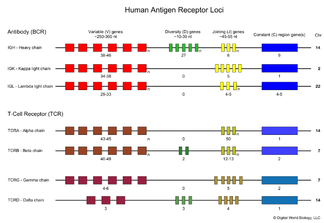
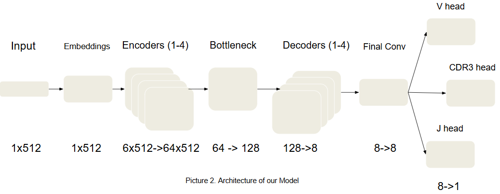

# VJeaNETte

Fast V(D)J sequence annotation tool for FASTQ data using a 1D U-Net model.

---

## 🧬 About

The human immune system generates an enormous diversity of receptors through **V(D)J recombination**, where V, D, and J gene segments are randomly assembled.

Each B- or T-cell gets a unique receptor, forming an **immune repertoire**.



Accurate identification of V and J segments is crucial for:

- immune response analysis
- cancer research
- vaccine development
- immunotherapy

**Goal of this project:**  
Detect **V, J and CDR3 regions** directly from sequencing data using deep learning.

---

## ⚙️ Features

- ⚡ Fast FASTQ inference (multi-threaded)
- 🧠 1D U-Net architecture for positional prediction
- 🎯 Detects V, J and CDR3 segments
- 🚀 GPU acceleration (CUDA)
- 📦 CLI + config via `pyproject.toml`
- 🛠 Training pipeline included

---

## 🧠 Model

- Encoder-decoder (U-Net-like)
- Positional prediction (not classification!)
- Separate heads for:
  - V segment
  - J segment
  - CDR3 region



---

## 🔧 Installation

### 1. Clone repo

```bash
git clone https://github.com/yourusername/VJeaNETte.git
cd VJeaNETte
```
---
### 2. Setup environment

```bash
make setup
```

#### For development:

```bash
make setup-dev
```
---
### ⚠️PyTorch (GPU)

#### If you want CUDA support:
```bash
venv/bin/pip install torch --index-url https://download.pytorch.org/whl/cu121
```
---
### 🚀 Quick Start
#### Inference
```bash
make run
```
##### or manually:
```bash
python -m vjeanette.run --in_file ./data/test.fastq
```
---
### Training
```bash
make train
```
---
## ⚙Configuration (pyproject.toml)
#### All parameters can be configured in:
```toml
[tool.vjeanette.data]
ig_file = "./data/train.tsv"
tcr_file = "./data/train_tcr.tsv"
pt_output = "./data/train_out.pt"
neg_ratio = 3

[tool.vjeanette.training]
epochs = 130
batch_size = 256
lr = 0.0003

[tool.vjeanette.model]
embed_dim = 32

[tool.vjeanette.output]
model_path = "./weights/model.pth"
```
---
📥  CLI Arguments
---
| Argument       | Description          | Default               |
| -------------- | -------------------- | --------------------- |
| `--in_file`    | Input FASTQ          | `./data/test.fastq`   |
| `--device`     | cuda / cpu           | `cuda`                |
| `--batch_size` | Inference batch size | `32768`               |
| `--n_cores`    | CPU workers          | `1`                   |
| `--out_file`   | Output CSV           | `./out/test_out.csv`  |
| `--logs`       | Log file             | `./logs/progress.log` |
| `--model_path` | Model weights        | `./weights/model.pth` |
---
📤 Output
---
| Column          | Description       |
| --------------- | ----------------- |
| read_id         | FASTQ read ID     |
| strand          | forward / reverse |
| has_v           | V detected (0/1)  |
| has_j           | J detected (0/1)  |
| v_start / v_end | V segment         |
| j_start / j_end | J segment         |
| score           | Confidence        |
---
📁 Project Structure
---
VJeaNETte/\
├── pyproject.toml\
├── Makefile\
│\
├── vjeanette/\
│   ├── run.py\
│   ├── train.py\
│   ├── preprocessing.py\
│   ├── core.py\
│   └── model/\
│       └── model.py\
│\
├── data/\
├── logs/\
├── weights/\
└── out/
---
⚡ Performance Tips
- Increase ``--batch_size`` for GPU speed
- Use ``--n_cores`` 4-8 for FASTQ parsing
- Mixed precision (FP16) enabled automatically on CUDA
---
🧪 Inference
```bash
make run
```
---
👨‍🔬 Authors
- Matvei Beliakov — SPbU
- Elisaveta Vlasova — RNRMU
- Mikhail Shugay — RNRMU
---
📬 Contact
neonlight20006@gmail.com
---
📌 Status
🚧 Active development