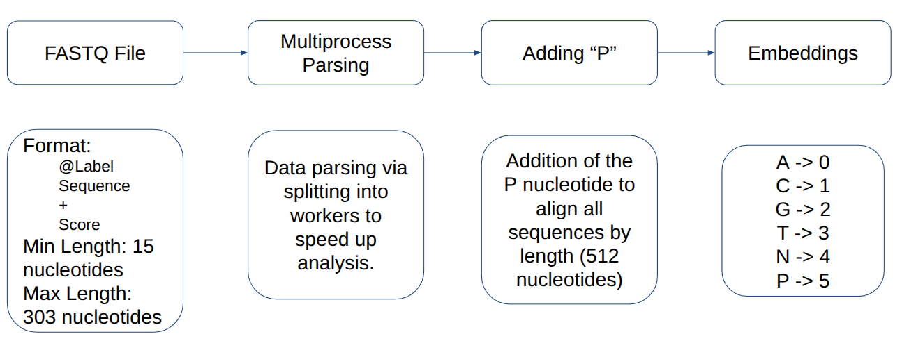
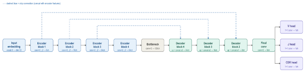

# VJeaNETte

## About problem

#### The human immune system has a wide variety of receptors that allow it to recognize an almost unlimited number of antigens. This diversity is formed by the V(D)J recombination process - the random assembly of genetic segments V, D, and J.

#### As a result, each B- or T-cell receives a unique receptor, and the combination of such receptors forms the so-called immune repertoire.


*VJ segments*

#### The analysis of this repertoire is of great practical importance.
#### It is used, for example, for:
- studying the immune response to infections,
- analyzing oncological diseases,
- development of vaccines and immunotherapy.

#### However, the key task in this analysis is to correctly identify the V, D, and J segments in the sequences. The purpose of our work was to create a model based on convolutional neural networks for detecting VJ fragments.

## Description

#### This tool allows you to find V, J and CDR3 segments in RNA-seq data by using Convolutional Neural Network.

### Preprocessing

#### Each nucleotide was encoded numerically, and a special symbol was added to align the sequences to a fixed length.



*Preprocessing scheme*

#### In addition, we implemented multithreaded processing of FASTQ files, which significantly accelerated data preparation.

### Model

#### A fixed-length sequence obtained after preprocessing is fed to the input of the model. The model is based on the encoder–decoder principle. The encoder gradually compresses the input sequence, extracting more and more abstract features. At this stage, the model learns to recognize local and more global structures in the data.

#### This is followed by the bottleneck layer, which plays the role of a "bottleneck" in which only the most significant information remains.

#### After that, the decoder restores the spatial structure, allowing you to switch back to positional prediction.

#### An important feature is that the model does positional detection, rather than just classifying the entire sequence. That is, at the output we get a probability distribution for each position, separately for V and J segments. For this, the architecture uses two output heads, one for V and the other for J. This allows the model to simultaneously solve two related tasks and take into account their interrelationship.



*Model architecture*

## Project Structure
VJeaNETte/\
├── run.py # Main entry point\
├── inference/ # Inference module\
│ ├── init.py # Package interface\
│ ├── core.py # Core inference logic\
│ ├── utils.py # Utility functions\
│ └── config.py # Configuration constants\
├── model/ # Model module\
│ ├── init.py\
│ ├── model.py # UNet1D_Embed architecture\
│ └── parser.py # FastqDataset\
├── logs/ # Log directory\
└── out/ # Output directory\


## Installing

#### Just _git clone_ it

```commandline
git clone https://github.com/yourusername/VJeaNETte.git
cd VJeaNETte
```

## Usage
```python
python run.py --in_file file.fastq [options]
```
## Command Line Arguments

| Argument            | Description                           | Default                    | Example                       |
|---------------------|---------------------------------------|----------------------------|-------------------------------|
| ```--in_file```     | Input FASTQ file (required)           | ```./data/test.fastq```    | ```--in_file sample.fastq```  |
| ```--device```      | Device to run inference on (cuda/cpu) | ```cuda```                 | ```--device cpu```            |
| ```--batch_size```  | Batch size for inference              | ```32768```                | ```--batch_size 16384```      |
| ```--n_cores```     | Number of CPU cores for data loading  | ```1```                    | ```--n_cores 4```             |
| ```--out_file```    | Output CSV file path                  | ```./out/test_out.csv```   | ```--out_file results.csv```  |
| ```--logs```        | Log file path                         | ```./logs/progress.log```  | ```--logs ./logs/run.log```   |
| ```--model_path```  | Path to model weights                 | ```./model/model_v1.pth``` | ```--model_path custom.pth``` |

## Example Commands
```python
# Basic usage with default settings
python run.py --in_file data/sample.fastq

# Run on CPU with custom batch size
python run.py --in_file data/sample.fastq --device cpu --batch_size 8192

# Run with multiple CPU cores for faster preprocessing
python run.py --in_file data/large_sample.fastq --n_cores 8 --batch_size 32768

# Full example with all parameters
python run.py --in_file data/immune_repertoire.fastq \
              --device cuda \
              --batch_size 65536 \
              --n_cores 4 \
              --out_file ./results/predictions.csv \
              --logs ./logs/inference.log
```
## Output Format


| Column        | Description                           |
|---------------|---------------------------------------|
| ```read_id``` | Original read identifier from FASTQ   |
| ```strand```  | Detected strand (forward/reverse)     |
| ```has_v```   | Whether V segment was detected (0/1)  |
| ```has_j```   | Whether J segment was detected (0/1)  |
| ```v_start``` | Start position of V segment           |
| ```v_end```   | End position of V segment             |
| ```j_start``` | Start position of J segment           |
| ```j_end```   | End position of J segment             |
| ```score```   | Confidence score for the prediction   |
## Performance Tips
1. **GPU Memory:** Adjust ```--batch_size``` based on your GPU memory. Start with 32768 and decrease if you get CUDA out of memory errors.

2. CPU Cores: Increase ```--n_cores``` for faster data loading (typical values: 4-8 cores).

3. Mixed Precision: The model automatically uses FP16 on CUDA devices for faster inference.

## Requirements
- Python 3.10+
- PyTorch 2.0+
- CUDA (optional, for GPU acceleration)
## Support

#### Contact with us via gmail:neonlight20006@gmail.com

## Contributing
#### Beliakov Matvei, Department of Biology, Saint-Petersburg State University
#### Vlasova Elisaveta, Immunosequencing Algorithms Laboratory, RNRMU
#### Mikhail Shugay, Immunosequencing Algorithms Laboratory, RNRMU
## Project status
#### Under active development